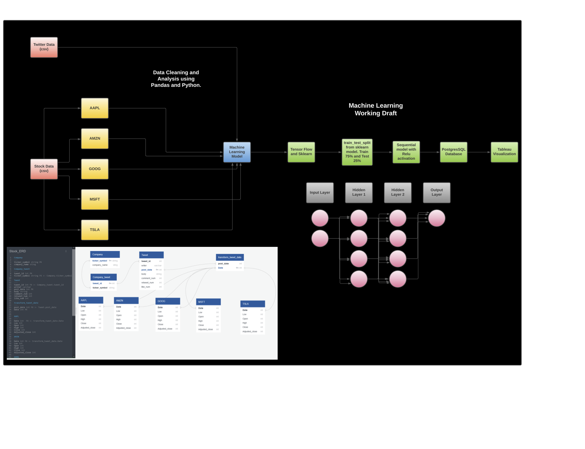

# Twitter & Stock Price Analysis  

## Purpose 

The purpose of this project is to analyze the correlation, if any, that engagement/activity of a stock's ticker on Twitter has on it's selling activity on the NASDAQ. The question that we'd like to answer is: can we predict how much a stock will sell based on how it's trending on social media?

## Technology 

  ### Data Cleaning and Analysis
   Excel and Pandas will be used to clean the data and perform an exploratory analysis. Further analysis and manipulation will be completed using Python. 

  Additionally VADER Sentiment Analysis will be used to get the overall sentiment of the tweet to turn string data into int data for a ML model & analysis.

  ### Database Storage
  PostgreSQL is the database we intend to use, since we are working with ‘.csv’ data files. and we will integrate Tableau to display the data.

  ### Machine Learning
  SciKitLearn or Tensorflow will be  the ML library we'll be using. Depending on what the data looks like after cleaning we will decide between a classification or   a regression model. 

  ### Dashboard
  Our final Dashboard will be presented on Tableau with all the findings and ML predictions.

## The Data 

The data that will be used in this analysis include a csv with opening/closing information for all NASDAQ, S&P500, and NYSE listed companies which is updated weekly. There are also csv's for tweets about the stock tickers of each of the top five technology companies (Amazon, Tesla, Google, Apple, Microsoft) from years 2015 to 2020. The planned ERD for the database that will connect each of these data sources looks like: 

## Machine Learning Model 

This analysis will use a neural network with Relu activation to model the correlation between volume of tweets and perception of tweets against the change in daily price. 

The current plan for the model is: 

