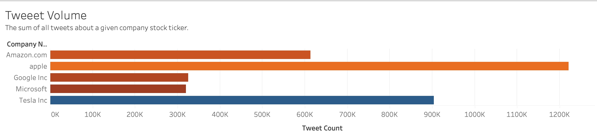
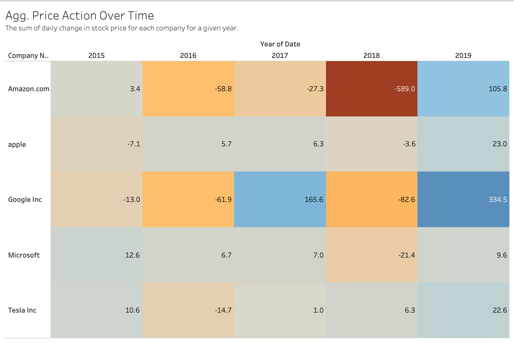
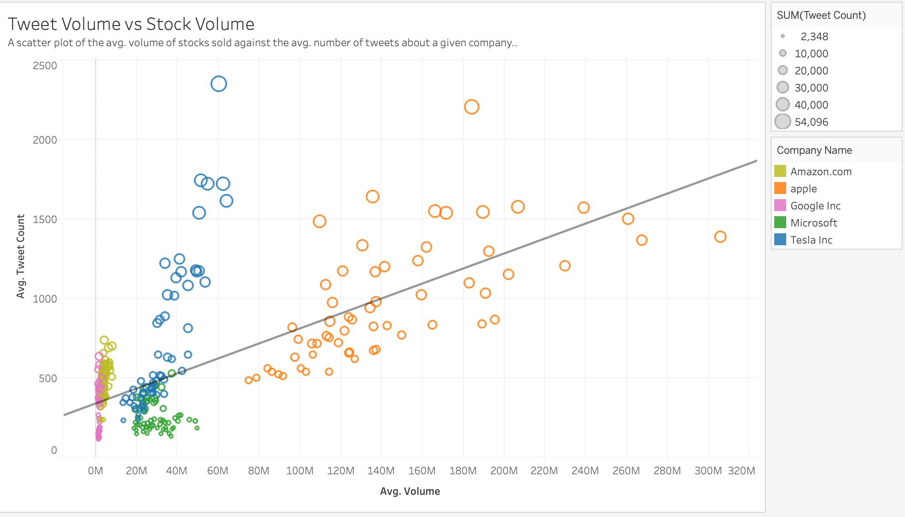
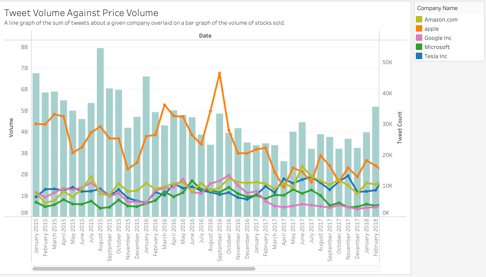
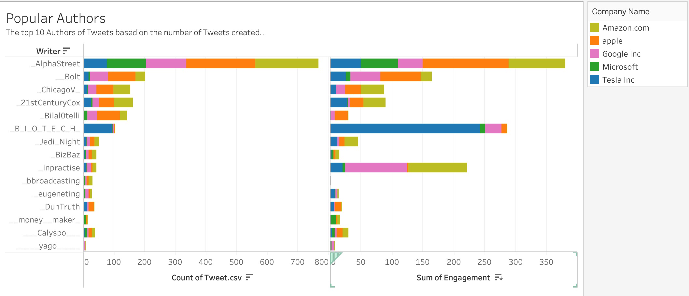
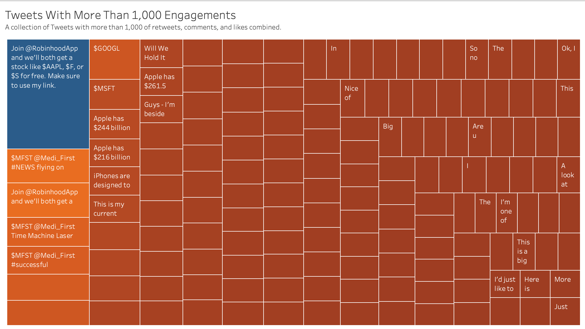

# Twitter & Stock Price Analysis  

## Purpose 

The purpose of this project is to analyze the correlation, if any, that engagement/activity of a stock's ticker on Twitter has on it's selling activity on the NASDAQ. The question that we'd like to answer are the follwowing: 

**Hypothesis:**
 - Can we predict how much a stock will sell based on how it's trending on social media?
 - Does tweets impact price action?

## Presentation Slides
Presentation slides to capture project summary, selection journey, technology used, data exploration, data analysis, machine learning, data visualization, conclusion and iteration opportunities. **[Click Here to Access Presentation Slides](https://docs.google.com/presentation/d/1eiDhg26rj6FX_s-b5r3N7FIJo1qq6LhwhcxKrEpWc80/edit?usp=sharing)**

## Technology 

  ### Data Cleaning and Analysis
  Excel csvs from Kaggle were used to import the data for tweet data, and Yahoo Finance was utilized for stock/ticker data (Apple, Tesla, Google, Amazon, and Microsoft). `Pandas` was to clean the data and perform an exploratory analysis. Further analysis and manipulation was completed using Python before the data was imported to our PostgresSQL database and connected to our machine learning model.

The ERD for the database that will connect each of these data sources is shown below.

  ### Database Storage
  The database utilized was PostgresSQL with pgadmin 4. Data collected from Kaggle and Yahoo Finance were cleaned during the pre-processing stages with `pandas` and brought into our environment. 5 Ticker tables were brought into our database, 1 for each ticker, and further consolidated to form our master table data. Postgres database was then connected our our machine learning ipynb file for further analysis for prediction and accuracy.

  ### Machine Learning
  SciKitLearn and Tensorflow is the ML library utilized. Machine Learning models utilized were `Linear Regression`, `Logistic Regression`, and `Artifical Neural Network`.

  ### Dashboard and Analysis
  Our final Dashboard is LIVE and available on Tableau public with our findings and ML predictions. Analysis includes dynamic integrations between tweet, date, and stock ticker to provide visual grasp to our end users on how tweets and the stock exchange share a relationship in stock liquidity. Analysis of our findings include Tweet Impacts on Stock Prices and Examining Tweet Engagement. 
  
  **[Click Here to Visit Our Tableau Public Dashboard.](https://public.tableau.com/app/profile/tara.flynn/viz/Tweet_Stock_Analysis/Dashboard12?publish=yes)** 

#### Dashboard Pre-Construction

*Purpose:* Identify framework of widgets, interactive elements, and portraying key stories using data analysis of Twitter's impact on NASDAQ Stocks.

#### Tweet Volume

 

*Purpose:* Find which companies are receiving the most tweets and interactions. 

*Analysis:* 
- Sum of all tweets 2015-2019 
- Color by sum of likes, comments, and retweets 

#### Price Action Over Time 

 

*Purpose:* Identify the companies seeing the most change in daily price. 

*Analysis:* 
- Yearly sum of Price Action per Company 
- Color based on Price Action 

#### Scatter Plot of Tweet and Stock Volumes 

 

*Purpose:* Identify the correlation between twitter activity and stock liquidity to align with machine learning. 

*Analysis:* 
- Scatter plot of Tweet Volume against Stock Volume 
- Size based on Tweet Volume 
- Trend line to indicate linear correlation 
- Color by company name 
- URL Action to Explore Machine Learning 

#### Twitter and Stock Volume Over Time 

*Purpose:* Can we identify any spikes in the Twitter and Stock volumes. 

*Analysis:* 
- A bar chart of all Tweet Volume 
- A line chart of Tweet Volume with colors by Company 
- Both plotted again Month-Year dates 
- URL Action to Explore Machine Learning

#### Popular Authors 

 

*Purpose:* Identify Tweet authors that may be driving spikes in engagement. 

*Analysis:* 
- Bar chart of authors and count of tweets 
- Bar chart of authors and sum of likes, comments, and retweets 
- Sorted by Count of Tweets 
- Color by company name 
- Filter by date 

#### Popular Tweets 

 

*Purpose:* Use bodies of popular Tweets to identify if any current events driving spikes in social media engagement. 

*Analysis:* 
- Heat map of Tweets with more than 1,000 combined retweets, likes, and comments 
- Color and size by sum of engagement 
- Filter by date 

## Machine Learning Model 

This analysis will use a neural network with Relu activation to model the correlation between volume of tweets and perception of tweets against the change in daily price. 

**Description of preliminary data preprocessing:**
 - the data pre-processing was done by first summing up the # of tweets for the day as `tweet_activity`and keeping the `date`, `volume` and `price-anction` for each ticker. Then seperating each ticker into their own csv file and exporting it into the ML model.

**Description of preliminary feature engineering and preliminary feature selection, including their decision-making process**
 - `tweet_activity` : was the tweet dataset summed up to it's most important factor because of it relation to the stock's price. selected as a feature.
 - `date`: trading date for each stock, was dropped when feeding it into the model because of it lack of importance to the model.
 - `volume`: a given tickers daily trading volume, used in the model as a feature.
 - `price-action`: very important features tells the price movement of the ticker in a given date. used in the model as a feature.
 - `liquid_lvl`: was the target of the dataset as the model was trying to predict how liquid the stock is given its `tweet_count`. 

**Description of how data was split into training and testing sets:**
 - the data for our model was split to the `train-test-split`'s default value, which allocates 75% of the data for trainig and 25% of testing.

**Explanation of model choice, including limitations and benefits:**
 - first `LinearRegression` was used to find a correlation in the dataset if any. `LinearRegression` although benifitial in looking at how one feature of the dataset influnces another, it's limited due to its simplicity and is unable to do a trainig and testing of the dataset. After finding a correlation between `volume` and `tweet-activity` `LogisticRegression` model was used to see how well the model could predict stock liquidity. `LogisticRegression` was successful in predicting a binary outcome, for our dataset but it's limited by low accuracy score and inability to fine tune the model.  

**Explanation of changes in model choice (if changes occurred between the Segment 2 and Segment 3 deliverables):**
 - for segment 3 a neural network model was added to improve accuracy score since `LogisticRegression` was only 57% accurate. The neural network uses one hidden layer and six neurons because of three input features for this model. This new model after 100 iterations gives us an accuracy socre of 97%.  

**Description of how they have trained the model thus far, and any additional training that will take place:**
 - the model was trained using `relu` in the hidden layer and `sigmoid` in the output layer as we need the model to tell us if the stock is either liquid or not. `StandardScaler` was used to scale training and testing the features. The model was ran for 100 epochs resulting in an accuracy score of 97%  

**Description of current accuracy score:**
 - As mentioned above the current model yields an accuracy score of 97%. Meaning the model can predict if a given stock is liquid (above avg daily volume ) feeding the dataset with extreme accuracy. 

## Conclusion
Through our research, we identified that our original hypothesis was indeed correct that Twitter activity has an impact and correlation with stock activity. From our findings, we were able to predict with a 97% accuracy of Tweets vs Stock Liquidity. Regarding twitter vs action price, we were not able to find a strong correlation, but we identified ways for research to be investigated further through next step iterations.

For next step iterations, there is opportunity to further drill into qualititative tweet features using Vader, to categorize tweets through positive, neutral, or negative tweets to further verify their impact on stock liquidity and of course price action. We believe that this next step iteration can be cruical to confirm if there is truly no further unknowns to uncover of tweets vs price action as well as further strengthen analysis possibilities based on positive, negative, or neutral sentiment.
